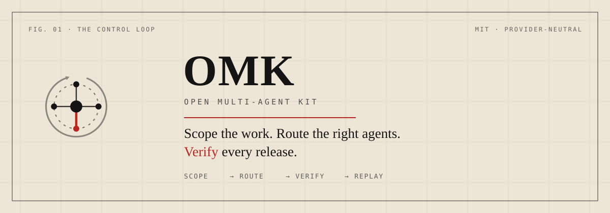
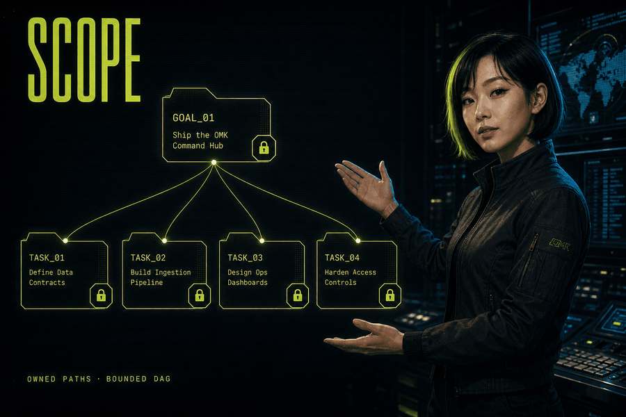
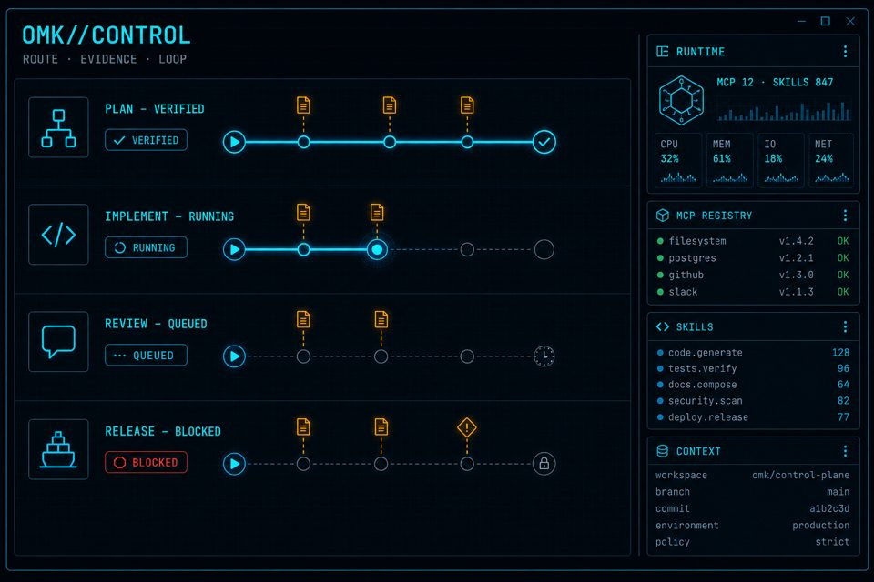
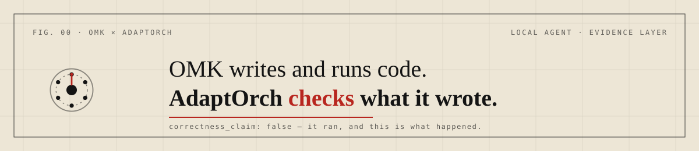

<p align="center">
  
</p>

<h1 align="center">OMK</h1>

<p align="center">
  <strong>Open Multi-Agent Kit</strong><br />
  Scope the work. Route the right agents. Verify every release.
</p>

<p align="center">
  Provider-neutral coding-agent CLI and multi-agent control plane for Codex,
  Claude Code, OpenCode, and local models.
</p>

<p align="center">
  <a href="https://www.npmjs.com/package/open-multi-agent-kit"></a>
  <a href="https://www.npmjs.com/package/open-multi-agent-kit"></a><br />
  <a href="https://github.com/dmae97/omk/releases/latest"></a><br />
  <a href="LICENSE"></a>
  
</p>

<p align="center">
  <a href="#quick-start">Quick start</a> ·
  <a href="#control-loop">Control loop</a> ·
  <a href="#verification-boundary">Safety boundary</a><br />
  <a href="#published-packages">Packages</a> ·
  <a href="packages/coding-agent/docs/index.md">Documentation</a>
</p>

---

## Why OMK

Coding agents can produce code quickly. They can also overlap work, lose state,
route to the wrong model, and claim completion before the build is green. OMK
adds a control plane around that work.

| Problem | OMK invariant | Inspectable output |
| --- | --- | --- |
| Concurrent work can collide | Tool claims serialize conflicts; optional orchestration workflows must declare path ownership | Tool schedule and workspace state |
| A model says “done” too early | Explicit verification workflows require fresh evidence; prompt settlement alone is not proof | Commands, exits, and receipts |
| A provider or model changes | Routing stays separate from the execution contract | Provider-attributed attempts |
| A session stops midway | Replayable state supports session recovery | Ledger, repair plan, durable goal |

OMK is for engineering work that needs a checkable result, not a convincing chat
response.

## Harness target

OMK targets state-of-the-art quality as a CLI coding-agent harness. The target
covers reliable task completion, cost and latency, context and tool efficiency,
bounded orchestration, safe execution, recovery, and verifiable outcomes.

**Current status: SOTA is not verified.** OMK does not claim leadership from
feature counts, test counts, self-scores, or roadmap projections. A comparative
claim requires a dated, reproducible, same-model evaluation against a named
cohort. See the [measurement protocol](packages/coding-agent/docs/metrics.md).

## Quick start

```bash
npm install -g open-multi-agent-kit --ignore-scripts
omk --version
omk
```

Without a global install:

```bash
npx --ignore-scripts open-multi-agent-kit
```

Requirements: Node.js 22.19 or newer. The published CLI package is
`open-multi-agent-kit`.

## Control loop

<p align="center">
  
</p>

1. **Scope** — bound the goal, paths, resources, and acceptance predicates. A
   selected orchestration workflow may also supply a DAG; an ordinary prompt
   remains one agent/tool loop.
2. **Route** — select models, agent skills, MCP tools, and extensions for the
   job without changing the evidence contract.
3. **Verify** — explicit evidence workflows run declared build, type, test,
   audit, and release gates. Required red predicates block those workflows.
4. **Replay** — preserve receipts, repair interrupted sessions, and continue
   durable goals from explicit reducer state.

The animation changes once every 1.5 seconds and contains no flashing. The four
steps above are the complete text alternative.

## OMK//CONTROL

The default operator surface shows active work, routing, context, MCP state, and
verification signals in one terminal UI.

<p align="center">
  
</p>

The header reads `omk v<package.version> · OMK//CONTROL`; the installed package
version is the source of truth.

## What ships

### Execution and optional orchestration

- One provider/tool loop with the CLI's deterministic `dag-v2` tool-call scheduler.
- An optional subagent extension plus packaged lane and shard primitives; the
  internal lane launcher and automatic command sharding are not default CLI paths.
- Explicit cancellation, timeout, and retry settlement.
- Durable goals and checkpointed continuation across bounded rounds.

### Evidence and recovery

- Verified-bash receipts, replay ledgers, session repair, and SDK inspection.
- Versioned `omk-protocol` observations, evaluations, and decisions for callers
  that explicitly adopt the protocol.
- Acceptance predicates backed by fresh evidence in those explicit workflows.
- Advisory judging that cannot replace required deterministic gates.

### Routing and extensibility

- Provider-neutral model registry through `omk-ai`.
- Agent skills loaded on demand instead of dumped into every prompt.
- MCP runtime client with lazy stdio server startup and registered tools.
- Extensions for tools, commands, events, providers, themes, and UI surfaces.

See [providers](packages/coding-agent/docs/providers.md),
[MCP](packages/coding-agent/docs/mcp.md),
[skills](packages/coding-agent/docs/skills.md), and
[extensions](packages/coding-agent/docs/extensions.md).

## Verification boundary

`AgentSession` built-in local bash uses OS sandbox enforcement by default:
`sandbox-exec` on macOS and `bwrap` plus unprivileged user namespaces on Linux.
Local shell spawns restrict writes to the workspace and OS temporary directory,
disable network access, and fail closed with `sandbox.backend_missing` when an
enforcement backend is unavailable.

This is **not** read-confidentiality or whole-process containment. Other file
tools, extension and custom-tool code, injected or remote `BashOperations`, and
the OMK process keep the permissions of the process running them. Use
[containerization](packages/coding-agent/docs/containerization.md) when the
boundary must cover more than built-in local bash. A run without required
evidence remains `UNVERIFIED`.

## Providers

OMK keeps routing separate from control and evidence. Codex, Claude Code,
OpenCode Zen/Go, Kimi, GLM/ZAI, native xAI/Grok, NVIDIA NIM, and local providers
can participate through `omk-ai` while the run contract stays stable.

Native `xai` keeps subscription OAuth and `XAI_API_KEY` billing separate. See
[provider setup](packages/coding-agent/docs/providers.md),
[provider resilience](packages/coding-agent/docs/provider-resilience.md), and
[Grok integration](packages/coding-agent/docs/grok-harness.md).

## Published packages

| Package | Purpose |
| --- | --- |
| [`open-multi-agent-kit`](packages/coding-agent) | Interactive coding-agent CLI and control plane |
| [`omk-agent-core`](packages/agent) | Agent runtime, tool execution, and DAG scheduling |
| [`omk-ai`](packages/ai) | Unified multi-provider LLM API |
| [`omk-protocol`](packages/protocol) | Versioned run contracts and semantic reducers |
| [`omk-adaptorch-wpl`](packages/adaptorch-wpl) | Work Packet Loop runtime |
| [`omk-book-to-skill`](packages/book-to-skill) | Optional document-to-skill compiler |
| [`omk-tui`](packages/tui) | Differential-rendered terminal UI library |

```bash
npm install omk-agent-core
npm install omk-ai
npm install omk-protocol
omk install npm:omk-book-to-skill@0.97.0
npm install omk-tui
```

## Repository understanding

`v0.97.0` shipped the OpenWiki policy and workflow, but no versioned corpus or
integrity checker. Current Worktree-only hardening remains blocked by the
security gates below:

- **`openwiki/`** — absent. The previous untracked corpus was removed after the
  hardened gate proved it carried fabricated evidence: 8 frontmatter symbols
  that no declared source path defines (`AgentLoop`, `getModel`, `DeepWall`,
  `loadExtensions`, `createExtensionRuntime`, `main`), 45 references to `@omk/*`
  package names this repository does not publish, and a
  restatement of this README's `Scope -> Route -> Verify -> Replay` loop as a
  strict engine state machine, which is not what the source implements.
  CI regenerates the corpus; nothing is lost.
- **`scripts/check-openwiki.mjs`** — worktree checker. An `interrupted` corpus
  now fails unless `openwiki/.manual-review.json` binds a review to the exact
  corpus digest, and every frontmatter symbol must bind to one of that page's
  own `source_paths` as a whole identifier.
- **`scripts/check-openwiki-output.mjs`** — output gate. The scheduled workflow
  may write, upload, and open a PR for `openwiki/` and nothing else, so a model
  reading this repository cannot reach `AGENTS.md`, `CLAUDE.md`, or the workflow
  that runs it. The gate runs once before the artifact leaves the read-only
  generating job and again before the PR, because the publishing job holds write
  permissions the first one does not.
- **`.understand-anything/`** — optional local structural graph used by Pi Lens;
  it is not published or injected into prompts by default.

Source and tests remain authoritative. Until the blockers above close and the
corpus ships, treat both generated indexes as untrusted working-tree or local
advisory data.

## OMK + AdaptOrch

<a href="https://adaptorch.com/?utm_source=github&utm_medium=readme&utm_campaign=omk">
  
</a>

Your agent produces 200 lines in ten seconds. You cannot read 200 lines in ten
seconds, so you skim — and skimming catches typos while missing the function
that quietly returns the wrong number. Then you merge, on a feeling, twenty
times a day.

Code is the one thing an AI produces that a machine can grade, because you can
simply run it. AdaptOrch does that: it copies your project into an isolated
sandbox, applies the change, runs the tests before and after, and returns one
page.

- Every file the change touched, including the ones nobody asked for.
- The test result before the change and after it — that gap is the evidence.
  A suite that is merely green proves much less than one that failed first.
- A verdict in words, with environment failures separated from code failures,
  so a dead network is never reported as a broken change.

That separation is the part worth having. "All green" means nothing if the test
was deleted; "I fixed it" means nothing if the test was already passing.

**What it does not claim: semantic correctness.** Shadow reports carry
`correctness_claim=false`, and hidden tests, gold patches, and oracle labels are
blocked as selector inputs. AdaptOrch reports — it never rewrites your code,
picks a different answer, or merges for you. Its published 30-task ledger
benchmark (synthetic tasks, not a real repository) records 8 broken changes
caught and 1 the gate itself got wrong; both numbers ship with the raw log.

Starter is free and self-hosted on your own machine. A bring-your-own model key
is required on every tier, so nothing executes without your key. It works
alongside any coding agent, OMK included.

### Two ways to reach it

**Hosted API (start here).** `omk-adaptorch-wpl` ships `AdaptOrchApiClient`, a
typed client for the AdaptOrch User API v1. It needs an API key and nothing
else — no engine install, no server process. The package still opens no network
I/O of its own, so you pass in `fetch` and keep ownership of the HTTP stack:

```ts
import { createAdaptOrchApiClientFromEnv } from "omk-adaptorch-wpl";

// undefined unless ADAPTORCH_API_KEY is set, so AdaptOrch stays opt-in
const adaptorch = createAdaptOrchApiClientFromEnv(fetch);
const run = await adaptorch?.submitRun({ subtasks: [{ prompt: "check this patch" }] });
const evidence = run && (await adaptorch?.getEvidence(run.run_id));
```

A tenant key (`ado_` prefix) is sent only as `X-API-Key`, never also in
`Authorization`; any other credential is sent as a bearer token. Plaintext HTTP
is refused except for an exact loopback host, and a credential is scrubbed from
any error message before it is raised.

**MCP server (local engine).** AdaptOrch also ships an MCP server
(`adaptorch-mcp`), which OMK attaches like any other MCP server — see
[MCP](packages/coding-agent/docs/mcp.md). This path wraps a *local* parent
engine, so it requires that engine installed. The tool surface is tiered, and
the tier matters: nine core tools reach a remote tenant, while trace and
topology reads exist only in a full or local deployment.

| Tier | Tools |
| --- | --- |
| Core (every deployment) | `adaptorch_run`, `adaptorch_get_run`, `adaptorch_get_artifacts`, `adaptorch_list_runs`, `adaptorch_cancel_run`, `adaptorch_server_metrics`, `adaptorch_capabilities`, `adaptorch_usage`, `adaptorch_plan_catalog` |
| Full or local only | `adaptorch_get_traces`, `adaptorch_route_topology` |

There are no benchmark or verification tools in that surface. `AdaptOrchClient`
in `omk-adaptorch-wpl` is a typed wrapper over these names, and exports the two
tiers as `ADAPTORCH_REMOTE_TOOLS` and `ADAPTORCH_FULL_ONLY_TOOLS` so a caller
cannot advertise a tool the tenant cannot reach. It ships no transport: supply
one, or attach the server through OMK's MCP client and let it own the boundary.

**[Review AdaptOrch plans →](https://adaptorch.com/?utm_source=github&utm_medium=readme&utm_campaign=omk#pricing)** · [claim boundary](https://adaptorch.com/claim-boundary?utm_source=github&utm_medium=readme&utm_campaign=omk)

OMK remains the local, MIT-licensed control plane and does not require
AdaptOrch; installing OMK does not create an account. `omk-adaptorch-wpl` in
this repository exposes Work Packet state, client, and adjudication primitives
rather than wiring AdaptOrch into the default CLI loop.

**These are two different products.** OMK is this MIT-licensed local control
plane: it scopes, routes, and runs work on your machine. AdaptOrch is a
separate commercial evidence layer that inspects a change after something
writes it. They share a visual design language because they are built by the
same people, not because they are the same product or one is a tier of the
other. Neither requires the other, and OMK ships nothing that calls AdaptOrch
by default.

<sub>The AdaptOrch name and marks identify that separate proprietary product
and appear here with permission. They are excluded from this repository's MIT
grant — see [LICENSE](LICENSE).</sub>

## Prior art

The design decisions behind OMK's context, routing, memory, and orchestration
layers are grounded in published work rather than invented in isolation. Each
row below was retrieved and read directly; claims are at abstract level, which
is the evidence grade this table asserts and no more.

| Paper | Mechanism it establishes | Where OMK applies it |
| --- | --- | --- |
| [arXiv:2608.22752](https://arxiv.org/abs/2608.22752) — *The Compaction Cliff in Long-Running AI Agent Memory* | Uniform summarization erodes rules and episodic logs at the same rate; measured safety-rule retention falls to 53% after one compaction and 10% after five. Type-tagged deterministic operators fix it. | Type-aware compaction triage: rule-typed items survive N rounds byte-identical |
| [arXiv:2608.23023](https://arxiv.org/abs/2608.23023) — *Most of the LLM Routing Gap Is Task Type* | Most routing gain is reachable with a fixed task-type table; run-to-run flips must not be credited as wins. | Frozen task-class table plus the 2-run stability rule in the promotion gate |
| [arXiv:2506.16655](https://arxiv.org/abs/2506.16655) — *Arch-Router: Aligning LLM Routing with Human Preferences* | Indirection: a classifier emits a label, a policy table maps label to decision, so models change without retraining. | `classifyTaskV4` plus `TASK_CLASS_THINKING_LEVELS` |
| [arXiv:2605.09894](https://arxiv.org/abs/2605.09894) — *Deterministic vs. LLM-Controlled Orchestration* | Holding model, prompts, and tools constant and varying only execution control, deterministic orchestration matched accuracy, improved worst-case robustness, and cut tokens up to 3.5x. | Deterministic scheduler and planned lanes; execution control is never delegated to the model |
| [arXiv:2608.15565](https://arxiv.org/abs/2608.15565) — *Admission Without Answers* | Label-free admission on execution success alone admits substantial contamination; an accept/abstain/escalate decision is required. | Verified-memory admission design (spec 019), abstain is not stored |
| [arXiv:2608.23471](https://arxiv.org/abs/2608.23471) — *InjecMEM: Memory Injection Attack on LLM Agent Memory Systems* | Single-interaction memory injection is a reproduced attack frame against agent memory. | Retrieved memory is injected only as provenance-tagged data, never fused into instruction position |

The full twenty-paper survey, including the clusters this table draws from and
the approaches deliberately **not** adopted, is in the
[v0.98.x roadmap](docs/OMK_v0.98x_PLANE_CONSOLIDATION_AND_LIVE_AUTHORITY_ROADMAP.md).

## Documentation

- [Documentation index](packages/coding-agent/docs/index.md)
- [Usage](packages/coding-agent/docs/usage.md)
- [Turn metrics and harness evaluation](packages/coding-agent/docs/metrics.md)
- [Providers and models](packages/coding-agent/docs/providers.md)
- [Automation and SDK](packages/coding-agent/docs/sdk.md)
- [Run protocol](packages/coding-agent/docs/run-protocol.md)
- [Runtime algorithms and direction](packages/coding-agent/docs/runtime-algorithms.md)
- [Specification index](specs/README.md)
- [Sessions and recovery](packages/coding-agent/docs/sessions.md)
- [Security](packages/coding-agent/docs/security.md)
- [Containerization](packages/coding-agent/docs/containerization.md)
- [Public skill catalog](SKILLS.md)
- [Changelog](packages/coding-agent/CHANGELOG.md)
- [Release notes for v0.97.0](.github/RELEASE_NOTES_v0.97.0.md)

## Development

```bash
npm ci --ignore-scripts
npm run build
npm run check
npm test
npm run release:local
```

Direct dependencies are pinned, CI installs with `--ignore-scripts`, and the
published CLI includes a generated `npm-shrinkwrap.json`. Read
[CONTRIBUTING.md](CONTRIBUTING.md) and the
[development guide](packages/coding-agent/docs/development.md) before sending a
change.

## FAQ

### Is OMK a coding agent or an orchestrator?

The default is an interactive coding-agent and tool loop. OMK also ships
optional orchestration extensions and explicit protocol/evidence APIs; internal
lane and shard primitives are not automatic multi-agent execution.

### Does OMK require one specific model provider?

No. Providers can change while the execution and evidence contracts remain
stable. Provider-specific capabilities still vary and are documented explicitly.

### How does OMK decide that work is complete?

An ordinary prompt ends when the agent loop and queued continuations settle;
`prompt_settled` is not a correctness verdict. In an explicit protocol/evidence
workflow, required predicates must pass with fresh evidence. Chat text, reviewer
opinion, or stale output cannot replace that gate.

### Can OMK recover an interrupted run?

Yes. Replay state, receipts, durable goals, and session repair preserve enough
structure for bounded recovery instead of silently starting over.

## Recent releases

> Historical correction: the immutable v0.97.0 notes below announced a
> versioned OpenWiki corpus, but that release still ignored `/openwiki/` and did
> not contain the corpus or checker. See the current repository-understanding
> section above for the working-tree repair.

<!-- releases:start -->

## Release v0.97.0

### Added

- Added the repository-understanding default: a generated `openwiki/` evidence index with grounded, staleness-tracked claims, OpenWiki managed blocks in root `AGENTS.md`/`CLAUDE.md`, a scheduled `openwiki-update` GitHub Actions workflow (Gemini provider by default), and a README section describing the local-wiki protocol for fresh sessions. The vendored `oh-my-pi` tree was removed; README now acknowledges pi (badlogic/pi-mono) and oh-my-pi as upstream origins.
- Added global-only `defaultActiveSkills` so operator-selected, user-scoped skill names can stay active in every prompt while full instructions remain on-demand.
- The model registry now keeps a bounded audit trail of every successfully loaded `models.json` (last 10 snapshots) and warns when model entries disappear between loads, so silent config rewrites by other sessions surface immediately instead of losing custom models.
- Images pasted or dragged into the interactive editor now attach as preview chips above the input through a bounded in-memory attachment store instead of per-paste temp files. Attachments are released exactly when their prompt is accepted and stay attached for retry when the turn fails before acceptance.
- Compaction summarization now walks the configured resilience failover chain once when the summarization model hits quota/billing exhaustion; if every candidate is also quota-blocked it fails with a new non-retryable `compaction.quota_exhausted` termination cause whose guidance points at `/model`, `compaction.model`, or waiting for reset.
- Upstream availability failures (gateway 5xx passthroughs, streams ending without a finish reason) are classified as network errors, and the retry path first rotates to another authenticated route serving the same underlying model family before falling back to the standard retry/failover chain.

### Changed

- YOLO mode (`OMK_YOLO` / `OMK_COMMAND_SAFETY=0` / `OMK_DISABLE_COMMAND_SAFETY`) is now evaluated in one place, the shared command-safety gate decision engine: every verdict — including block-tier commands and privilege prompts — runs without prompting, and the RPC headless bash safety floor honors the same opt-out.
- Refreshed the bundled model catalog (new DeepSeek V4 Flash Vision experimental routes and Thinking Machines Inkling free routes; removed dead free-tier aliases).

### Security

- The bash command-safety classifier now extracts command substitutions (`$(...)`, backticks, `<(...)`/`>(...)`) with quote-aware matching and recursively classifies their bodies up to a bounded depth, merging every risk signal by severity instead of returning on the first hit, so a destructive body such as `echo $(rm -rf ~)` can no longer ride behind a benign-looking outer command.

### Fixed

- Empty streamed completions (`stop` with no text, thinking, or tool call) are now treated as dead streams and retried within the existing retry budget instead of being accepted as a successful turn.

Release notes live in [RELEASE_NOTES_v0.97.0.md](.github/RELEASE_NOTES_v0.97.0.md).

## Release v0.96.2

### Added

- Added resource-aware host snapshots, admission decisions, generation-safe per-run tool-cap leases, workload classification, weighted FIFO permits, and `omk doctor resources` / `/resource` operator surfaces.
- Added internal Vitest, Jest, workspace, and Go shard planners plus a journaled executor with corruption quarantine, completed-shard resume, admission-aware execution, and aggregate `workload_shard_result.v1` evidence. Automatic session-command sharding is not enabled.
- Added an internal subagent lane launcher that enforces parent admission width and shares its permit pool; live child-launch wiring is not enabled.
- Added exactly-once `prompt_settled` and an opt-in completion sound.
- Added a local-only resource observation journal at `.omk/runs/<promptRunId>/resource-observations.jsonl`, recording bounded probe health, admission caps, classification, permit waits, settlement, and sound outcomes without raw host measurements.
- The `QWEN TOKEN PLAN` status entry now uses the official QwenCloud management CLI to show the seven-day usage window and reset time.

### Changed

- The session-termination classifier now accepts `resource.*` causes for memory, disk, CPU, heap, unavailable probes, and permit queue overflow. Only CPU pressure can qualify for automatic retry; live resource gates currently return bounded block results.
- `resourceGovernor.mode: "observe"` is the default and records decisions without enforcing caps. Both `"observe"` and `"off"` preserve v0.96.1 scheduling behavior.

### Fixed

- Top-level `omk --help` now lists `omk doctor resources [--json]`.
- Removed development-only `prepare` and `postinstall` hooks from the published CLI manifest; default npm installs no longer call an unshipped workspace-linking script.
- Bound resource observations and completion-sound results to their originating prompt journals, including consecutive fast observe-mode runs.
- Capped workspace shard plans at 16 while preserving every workspace through deterministic chunks.
- Ensured `prompt_settled` consistently follows `agent_end` as the final run event.

### Security

- Qwen quota discovery never sends an inference API key to a management endpoint, never reads browser cookies, and passes only non-secret process context to the QwenCloud child CLI.
- Removed the shipped subagent example's `offensive-jailbreak` skill route.

### Docs

- Documented an attributable AdaptOrch.com link for evaluating a separate hosted patch-evidence service; AdaptOrch remains distinct from the MIT-licensed OMK packages.

Release notes live in [RELEASE_NOTES_v0.96.2.md](.github/RELEASE_NOTES_v0.96.2.md).

## Release v0.96.1

### Added

- Added built-in harness loop extensions: identical-loop detection, compaction tool-pair repair, Kimi/K3/GLM/Grok/Claude prompt presets, and `/goal` with automatic continuation plus explicit `pause`, `resume`, evidence-gated `complete`, and `clear` lifecycle commands.
- Added pass-gated advisory best-of-N selection with strict weighted judge responses, forced-redacted candidate material, deterministic fallback, evaluation-bound request digests, and an explicit `ModelRegistry`-backed LLM adapter.
- Added digest-bound `Goal / Core / Verified / Open / Next` seam checkpoints to the existing durable-goal journal, including `/goal checkpoint <json>` and checkpoint-aware continuation.
- Added `omk sdk session status|tail|inspect|send` for external session controllers. Ambiguous selectors now fail closed, writes require exact IDs, active owners block concurrent access, and credential-shaped transcript text is redacted from output.
- Legacy `read` mode (`OMK_OMP_SEAMS=0`) now reports a private `0700` temporary spill directory with an exclusive `0600` file for recoverable line or byte truncation; it never writes beside or through the source path. A first line that alone exceeds the byte cap remains preview-only.

### Changed

- Sandbox backend probing is now cached per local bash operations instance. All enforce-mode fallback verdicts share the concrete missing-backend diagnosis (`bwrap`, user namespaces, `sandbox-exec`, or unsupported platform). Policy semantics are unchanged.
- Extracted the session system-prompt assembly from `AgentSession._rebuildSystemPrompt` into the pure `assembleSessionSystemPrompt` module (`core/session-system-prompt.ts`). Provider playbook resolution stays at the call site; the assembly is now directly testable.
- Extracted the retry/failover decisions from `AgentSession._isRetryableError` and `_prepareRetry` into the pure `core/provider-retry.ts` module (`isRetryableAssistantError`, `nextRetryAttempt`, `computeRetryDelayMs`). Retry ordering, backoff, and failover semantics are unchanged.
- Extracted the compaction gates from `AgentSession._checkCompaction` into the pure `core/compaction-gate.ts` module (`shouldSkipCompactionCheck`, `isSessionModelOverflow`). Gate ordering and staleness semantics are unchanged.
- Extracted the failover trigger and refused-model bookkeeping from `AgentSession._maybeFailoverFromSafetyStop` into `core/provider-retry.ts` (`isFailoverTriggerError`, `failoverModelKey`). Chain ordering and blacklist semantics are unchanged.
- Extracted the context-budget arithmetic from `AgentSession._getContextBudgetOptions` into the pure `core/prompt-budget.ts` module (`computePromptTokenBudget`, `computeResponseReserveTokens`). Env parsing stays at the call site; budget values are unchanged.
- Extracted the prompt-cache key transition classification from `AgentSession._recordPromptCachePlan` into the pure `core/prompt-cache.ts` module (`classifyPromptCacheTransition`). Counter and break-reason semantics are unchanged.
- Grok 4.5 / 4.3 now expose `/think max` and `ultra` in the selector. Those aliases still send xAI `reasoning_effort: "high"` because those models have no upstream `xhigh`/`max` tier.
- Native xAI SuperGrok usage now polls `GET https://cli-chat-proxy.grok.com/v1/billing?format=credits` and shows the weekly SuperGrok pool from `creditUsagePercent`. Stale `grok-oauth-proxy` credentials are dropped from `/login` and `/logout`.

### Fixed

- Durable-goal continuation now records and skips an unavailable WSL/project workspace instead of emitting an `ENODEV` extension stack after every failed provider attempt.
- Content/safety refusals are capped at one same-model retry when failover is unavailable, preventing the default transport retry budget from replaying the same refusal three times.
- Fable models remain visible in the model catalog, and a saved Fable default is honored when sticky-safety blocking is disabled.
- Claude models now omit discovered context files by default, avoiding provider false positives from unrelated instruction text; `OMK_CLAUDE_CONTEXT_FILES=1` restores the full context.
- Extension `resourceClaims` now survive both tool-definition adapters, allowing `dag-v2` to schedule non-conflicting custom tool calls concurrently instead of treating them as unclaimed exclusive work.
- Built-in tool-pair repair now uses the real `AgentMessage` contract (`toolCall` blocks and top-level `role: "toolResult"` messages), removing orphan pairs without unsafe message-shape casts.
- Pinned the transitive development dependency `nanoid` to 3.3.18, clearing GHSA-2v37-7h3g-55p8 from both full and production npm audits.

### Docs

- Redesigned the root README around the Scope → Route → Verify → Replay control loop with a WCAG-aware cyberpunk OMK Girl hero and slow feature GIF generated through GPT Image 2. The root `DESIGN.md` now defines public brand tokens, media budgets, and reduced-motion guidance.

### Removed

- Removed the `grok-oauth-proxy` provider path. Grok harness dispatch, failover, usage, and presets now use native `xai`. Stale `models.json` entries for `grok-oauth-proxy` are ignored instead of reappearing in `/login` and `/model`.

Release notes live in [RELEASE_NOTES_v0.96.1.md](.github/RELEASE_NOTES_v0.96.1.md).

<!-- releases:end -->

## Acknowledgments

OMK builds on [pi](https://github.com/badlogic/pi-mono) — Mario Zechner's
MIT-licensed coding-agent harness — and began from the
[oh-my-pi](https://github.com/can1357/oh-my-pi) fork. The vendored tree was
removed in this release line; OMK `0.9x` is OMK-native (see
[`specs/constitution.md`](specs/constitution.md)), and the design debt to both
projects stands. Thank you.

## License

MIT
