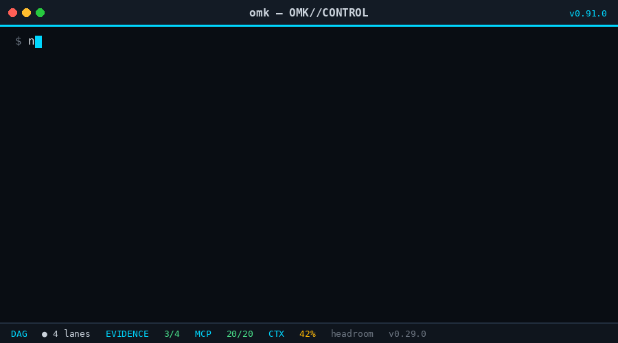
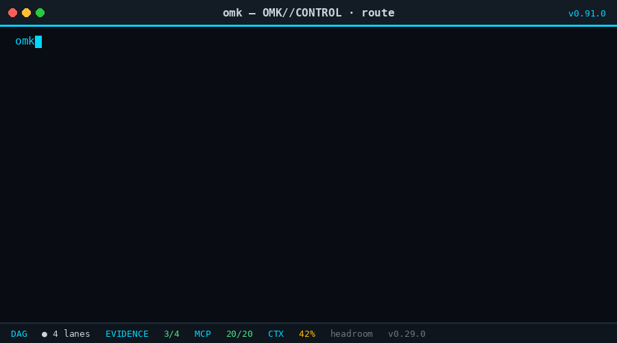
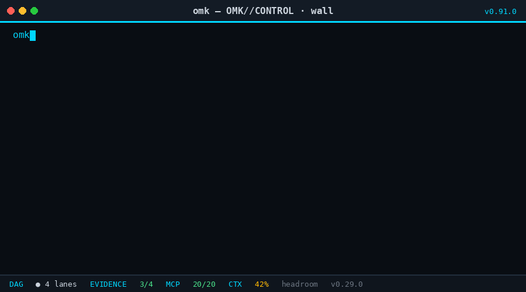
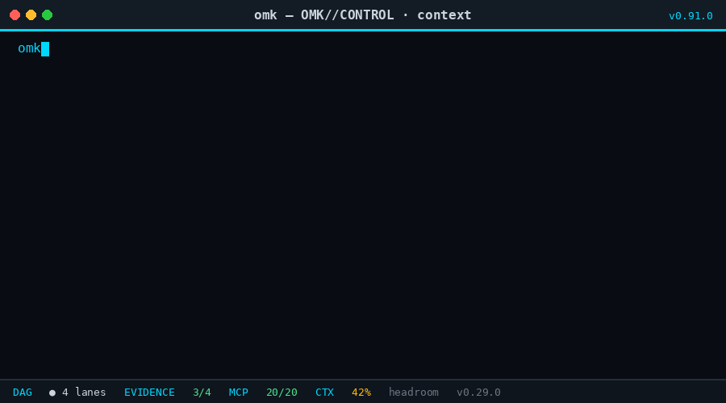
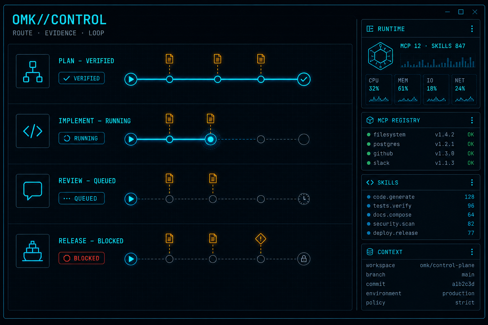

<p align="center">
  
</p>

<p align="center">
  
</p>

<h1 align="center">OMK</h1>

<p align="center">
  <strong>Open Multi-Agent Kit — provider-neutral coding agent, multi-agent orchestration, and evidence-gated control plane.</strong>
</p>

<p align="center">
  OMK is an open-source multi-agent coding harness: route work across models,
  bound parallel lanes, block outcomes, and keep replayable evidence for Codex,
  Claude Code, OpenCode, and local agents.
</p>

<p align="center">
  <em>Keywords:</em> multi-agent orchestration · coding agent CLI · provider-neutral LLM router ·
  evidence-gated automation · agent skills · MCP · DAG parallel agents · session recovery
</p>

<p align="center">
  <a href="https://www.npmjs.com/package/open-multi-agent-kit"></a>
  <a href="https://www.npmjs.com/package/open-multi-agent-kit"></a>
  <a href="https://www.npmjs.com/package/open-multi-agent-kit"></a>
  <a href="https://github.com/dmae97/omk/releases/latest"></a>
  <a href="LICENSE"></a>
  
</p>

<p align="center">
  <a href="https://www.npmjs.com/package/open-multi-agent-kit"></a>
  <a href="https://www.npmjs.com/package/omk-ai"></a>
  <a href="https://www.npmjs.com/package/omk-agent-core"></a>
  <a href="https://www.npmjs.com/package/omk-tui"></a>
  <a href="https://www.npmjs.com/package/omk-adaptorch-wpl"></a>
</p>

---

## Scope. Verify. Replay

**What is OMK?** A verified, provider-neutral **control plane for coding agents**
(Codex, Claude Code, OpenCode, local models). It turns a goal into a bounded DAG,
runs parallel lanes with owned paths, blocks “done” without fresh evidence, and
stores replayable receipts for review and recovery.

Use OMK when you need multi-agent software engineering with acceptance predicates,
not chat that only *claims* the build is green.

| Problem | OMK |
| --- | --- |
| Parallel agents overwrite the same work | Resource claims and owned paths bound each lane |
| An agent says "done" before the build is green | Acceptance predicates block unverified completion |
| A session crashes midway | Replayable state and session repair preserve the run |
| The preferred model changes | The control and evidence model stays stable |

---

## OMK in motion

Ten short captures of the control plane's main workflows.

### 1 · Install and boot

<p align="center">
  
</p>

### 2 · Goal to DAG

<p align="center">
  
</p>

### 3 · Parallel lanes

<p align="center">
  
</p>

### 4 · Provider routing

<p align="center">
  
</p>

### 5 · Evidence gate

<p align="center">
  
</p>

### 6 · Skill routing

<p align="center">
  
</p>

### 7 · MCP health

<p align="center">
  
</p>

### 8 · Context budget

<p align="center">
  
</p>

### 9 · Session doctor

<p align="center">
  
</p>

### 10 · Packages and themes

<p align="center">
  
</p>

---

## What OMK controls

- **Execution scope** — resource claims, owned paths, bounded parallel lanes
- **Completion** — declared predicates and fresh verification
- **Evidence** — commands, exit status, workspace state, receipts
- **Recovery** — replayable session state and repair tooling
- **Providers** — one operator model across supported coding agents

---

## Installation

```bash
npm install -g open-multi-agent-kit --ignore-scripts
omk --version
omk
```

Or without a global install:

```bash
npx --ignore-scripts open-multi-agent-kit
```

The `open-multi-agent-kit` package ships OMK.

---

## OMK//CONTROL TUI

The OMK//CONTROL startup surface is the default operator view.
The header reads `omk v<package.version> · OMK//CONTROL`, using the
installed workspace package version as its source of truth.

<p align="center">
  
</p>

---

## Core concepts

### Scope

`!omk plan` turns a fuzzy objective into a bounded DAG: owned paths,
ordered waves, and an acceptance predicate attached to every node before
a single line of code is written.

### Predicates

The Correctness Wall intercepts writes and runs acceptance predicates.
A red predicate blocks completion — a green-looking reply alone is not a
release signal.

### Receipts

Every verified run produces a receipt: commands, exit codes, workspace
state, evidence digest, and timestamps. Receipts are inspectable artifacts,
not marketing claims.

### Replay

`omk session doctor` detects unterminated turns and orphan results, then
plans a dry-run repair against the replay ledger. An
interrupted run is a recoverable state, not a loss.

---

## Supported agents and providers

OMK is provider-neutral. The underlying agent can be Codex, Claude Code,
OpenCode, or a local model; the execution and evidence
model stays consistent.

Providers stay interchangeable. The routing layer picks the best arm
for the task, but the control plane never changes when you swap models.
NVIDIA NIM's `z-ai/glm-5.2` entry transmits reasoning effort through `max`.
Quota and billing-cycle failures can switch to an authenticated resilience
candidate before retry; see [provider resilience](packages/coding-agent/docs/provider-resilience.md).

---

## Verification boundary

OMK is not a security sandbox for arbitrary hostile code by default.
Supported verification and sandbox modes are documented explicitly.
Any run without the required evidence is labeled `UNVERIFIED`.

See [containerization.md](packages/coding-agent/docs/containerization.md)
for sandbox patterns: OpenShell, Gondolin micro-VM, and plain Docker.

---

## Extensions, MCP, and skills

OMK packages distribute skills, extensions, prompts, and themes through
one control plane. Build a package once, install it through `omk`, pin
it, scope it to a project when needed.

Public repository skills are listed in [SKILLS.md](SKILLS.md). Operator installs
can also load hubs such as **`omk-marketing`** (routes the bundled marketing/
SEO skill pack) without dumping every skill into context.

MCP is a **runtime client**, not just a health view: configured stdio servers are
started on demand and their tools are registered into the session as
`<server>__<tool>`. Connection is lazy, and a server that fails to start is
reported without affecting the rest of the session. See
[docs/mcp.md](packages/coding-agent/docs/mcp.md), or run
`node scripts/mcp-smoke.mjs` to see what your configuration actually resolves to.

### Marketing, SEO, and AEO skill map

For growth work, start with `!skill:omk-marketing` (or `/skill:omk-marketing`).
It routes to the smallest subset of the marketingskills pack. Common intents:

| Intent | Skills to load |
| --- | --- |
| **SEO / AEO / discoverability** | `seo-audit`, `ai-seo`, `programmatic-seo`, `schema`, `site-architecture`, `content-strategy` |
| **Positioning & research** | `product-marketing`, `customer-research`, `competitors`, `competitor-profiling`, `marketing-plan`, `marketing-psychology` |
| **Copy & content** | `copywriting`, `copy-editing`, `content-strategy`, `emails`, `social`, `video`, `image`, `ad-creative` |
| **Conversion** | `cro`, `signup`, `onboarding`, `paywalls`, `popups`, `pricing`, `offers`, `ab-test-setup`, `ab-testing` |
| **Acquisition** | `ads`, `paid` routes via `ads`/`ad-creative`, `cold-email`, `directory-submissions`, `lead-magnets`, `free-tools`, `aso`, `sms` |
| **Lifecycle & revenue** | `churn-prevention`, `referrals`, `revops`, `sales-enablement`, `prospecting`, `co-marketing`, `community-marketing`, `public-relations`, `launch` |
| **Measurement & ops** | `analytics`, `marketing-loops`, `marketing-ideas`, `marketing-council` |

Load **one primary skill** (plus at most one supporter). Prefer evidence
(`analytics`, research) before spend or publish actions.

### Harness Graph (agents × skills × hooks × MCP)

Repository checkouts include a **build-time harness control plane** under
[`.omk/harness-graph/`](.omk/harness-graph/):

```bash
bash .omk/harness-graph/run.sh
# read: .omk/harness-graph/out/dashboard.md  ·  SCORECARD.md
```

It inventories agent→skill/hook/MCP edges, ranks bipartite SPOFs, clusters skills
(Louvain), scores association lift, recommends wiring (hybrid CF), and fail-closes
on new dead links. See the [harness-graph README](.omk/harness-graph/README.md)
and [scorecard](.omk/harness-graph/SCORECARD.md).

```bash
# Global, pinned OMK package
omk install npm:some-omk-package@1.2.3

# Project-local, pinned Git package
omk install -l git:github.com/example/omk-package@v1.2.3

# Inspect and control installed resources
omk list
omk config
omk update --extensions
```

A skills-only package is an ordinary OMK package:

```json
{
  "name": "omk-workflows",
  "keywords": ["omk-package"],
  "omk": {
    "skills": ["./skills"]
  }
}
```

Use the minimum necessary skills per turn — usually one to three.
A skill is loaded when it earns its place in the task, not because it
happens to be installed.

---

## Published packages

| Package | Description |
| --------- | ------------- |
| **[omk-ai](packages/ai)** | Unified multi-provider LLM API (OpenAI, Anthropic, Google, etc.) |
| **[omk-agent-core](packages/agent)** | Agent runtime with tool calling and state management |
| **[omk-protocol](packages/protocol)** | Versioned run contracts and pure semantic reducers |
| **[omk-book-to-skill](packages/book-to-skill)** | Optional document-to-skill compiler and provenance adapter |
| **[open-multi-agent-kit](packages/coding-agent)** | Interactive coding agent CLI |
| **[omk-tui](packages/tui)** | Terminal UI library with differential rendering |

```bash
npm install omk-agent-core   # Agent runtime
npm install omk-ai           # Multi-provider LLM API
npm install omk-protocol     # Run contracts and semantic reducers
omk install npm:omk-book-to-skill@0.95.2  # Optional document compiler
npm install omk-tui          # Terminal UI
```

---

## Adaptorch MCP integration

[AdaptOrch MCP](https://adaptorch.ai.kr) is a separate, proprietary
reliability-kernel service (not part of this monorepo) that OMK can route
orchestration tasks through: topology-aware DAG routing, multi-model
synthesis, and consistency verification. Backed by a published paper
([arXiv:2602.16873](https://arxiv.org/abs/2602.16873)).

The `adaptorch` and `adaptorch-prod` MCP servers plus the `adaptorch-route`
and `adaptorch-synthesize` skills ship in OMK's default execution preset.
Actually invoking AdaptOrch still requires an `ADAPTORCH_CONTROL_PLANE_TOKEN`.

This is distinct from `packages/adaptorch-wpl` in this monorepo, the stable
Work Packet Loop package shipped as a runtime dependency of
`open-multi-agent-kit` since v0.91.0.

---

## Development

```bash
npm ci --ignore-scripts  # Install the locked dependency graph
npm run build            # Build all packages
npm run check            # Lint, format, and type check
npm test                 # Run the hermetic default test suite
./omk-test.sh            # Run OMK from sources
```

## Supply-chain hardening

- Direct external dependencies are pinned to exact versions.
- `.npmrc` sets `save-exact=true` and `min-release-age=2`.
- `package-lock.json` is the dependency ground truth.
- `npm run check` verifies pinned direct deps and the generated shrinkwrap.
- The published CLI includes `npm-shrinkwrap.json` to pin transitive deps.
- CI installs with `npm ci --ignore-scripts`; scheduled audits run `npm audit`.

---

## Contributing

See [CONTRIBUTING.md](CONTRIBUTING.md) for contribution guidelines and
[development.md](packages/coding-agent/docs/development.md) for project setup.

## Documentation

- [Read the documentation](packages/coding-agent/docs/index.md)
- [Browse all public Skills](SKILLS.md)
- [Harness Graph control plane](.omk/harness-graph/README.md)
- [Changelog (coding-agent / open-multi-agent-kit)](packages/coding-agent/CHANGELOG.md)
- [Release notes for v0.95.2](.github/RELEASE_NOTES_v0.95.2.md)
- [Unreleased draft notes](.github/RELEASE_NOTES_UNRELEASED.md)

### FAQ (AEO)

**Is OMK a coding agent or an orchestrator?** Both: `open-multi-agent-kit` is an
interactive coding-agent CLI; OMK//CONTROL adds multi-agent DAG lanes, skill/MCP
routing, and evidence gates on top.

**Which models does OMK support?** Provider-neutral — Codex, Claude, OpenCode Zen/Go,
Kimi, GLM/ZAI, NVIDIA NIM, local providers, and more via `omk-ai`. Swap models
without changing the control/evidence model.

**How is completion verified?** Acceptance predicates and fresh command evidence.
Unverified runs are labeled `UNVERIFIED`; green chat is not a release signal.

**Can OMK do marketing/SEO work?** Yes, via skills (`omk-marketing` hub + SEO/CRO/
content skills listed above). Publishing, ads spend, and outreach still require
explicit operator confirmation.

**Where do release notes live?** Versioned notes under [`.github/RELEASE_NOTES_v*.md`](.github/);
the coding-agent [CHANGELOG](packages/coding-agent/CHANGELOG.md) is the source of
truth and syncs the “Recent releases” block below (`npm run sync:readme-releases`).

## Recent releases

<!-- releases:start -->

## Release v0.95.2

### Changed

- macOS sessions now derive replay-ledger process identity from bounded BSD `ps -o lstart=` output, so replay-lock acquisition no longer fails closed during AgentSession startup on Darwin while Linux `/proc` behavior remains unchanged.
- The status rail now verifies connected MCP servers with protocol pings, marks dead processes as failed, and retries failed servers on a bounded slower cadence without spawning idle servers.
- Interactive UX now includes an empty-editor affordance hint, elapsed-time and interrupt details on the working indicator, transient information notices, width-safe editor scroll borders, and opt-in footer CPU/memory metrics.
- Extension tools can resolve timeouts from current context. The subagent extension uses this to remove task-count, concurrency, execution-budget, attempt, and outer tool-timeout caps in Ultra while preserving explicit cancellation and non-Ultra limits.
- The startup control panel now identifies the product with `WELCOME TO OMK` instead of legacy Pi agent branding.
- Context-budget prompts use compact metadata for valid zero-resource plans while retaining cache-state and legacy optimizer compatibility telemetry; diagnostic and non-empty plans keep full observability, and invalid budgets bypass the plan cache so diagnostics cannot be hidden by a prior hit.
- The workspace context-budget cache scans every persisted key/value, keeps credential-shaped entries in memory only, and removes unsafe legacy snapshots instead of persisting secret-shaped text.
- Exact context representations now reuse content-addressed cache entries across different queries and budget sizes instead of forcing avoidable misses.
- Opt-in reasoning-router learning now isolates default ledgers and compiled bias snapshots per repository or git worktree, captures explicit manual thinking-level overrides as bounded feedback, and keeps updates behind the shipped, deterministic `omk router-feedback compile-bias` between-session command. Snapshot loading rejects nonzero biases below the strong-evidence threshold, unsafe or inconsistent counts, and duplicate cells; compilation uses an exclusive randomized temporary file before atomic rename.
- Session bash now defaults to OS sandbox enforcement instead of ledger-only audit mode. macOS `sandbox-exec` and Linux `bwrap` restrict writes to the workspace/temp directories and disable network access; missing backends fail closed. Unwrapped `audit` and disabled `off` modes now require an explicit `OMK_BASH_SANDBOX` value, and unknown values resolve to `enforce`.

Release notes live in [RELEASE_NOTES_v0.95.2.md](.github/RELEASE_NOTES_v0.95.2.md).

## Release v0.95.1

### Added

- **Harness Graph control plane** (`.omk/harness-graph/`): deterministic agents×skills×hooks×MCP inventory with 3-tier skill classification, bipartite SPOF criticality, Louvain communities, association-rule lift, hybrid CF wiring recommendations (`jaccard · idf · lift_boost`), fail-closed `health_gate.py` + debt allowlist, executive `dashboard.md`, review-only `wiring-patch`, synthetic unit + property tests, and CI workflow `.github/workflows/harness-graph.yml`.
- **Harness Graph ops tooling**: `compact-skills-index.mjs` (demand-union index rebuild), `prune-retired-hooks.mjs` (retired hook capability cleanup), `apply-wiring-patch.py` (half-bundle completion checklist), session-start drift audit hook with optional `HARNESS_GRAPH_STRICT=1`.

### Fixed

- Harness Graph green-metric traps: runtime-derived hook/MCP catalogs (no hardcoded answer keys), bipartite SPOF instead of empty articulation tables, default-only model-drift axis (failover is advisory), skills-index no longer dumps the full on-disk universe into false orphan-active counts.

### Docs

- Root README: AEO/SEO-oriented positioning, FAQ, and marketing/growth skill keyword map (`omk-marketing` + marketingskills pack).
- Spec/plan/scorecard for harness-graph engineering (`specs/012-harness-graph-engineering/`, `.omk/harness-graph/SCORECARD.md`).

Release notes live in [RELEASE_NOTES_v0.95.1.md](.github/RELEASE_NOTES_v0.95.1.md).

## Release v0.95.0

### Added

- Added explicit multi-account subscription authentication: `/login` now opens an account picker for configured OAuth providers, offers a separate **Add another account** action, captures ChatGPT/Claude/Google email identities, and pins requests to the selected account without silent rotation or failover.
- Added multi-provider quota meters to the pinned STATUS RAIL: every configured Codex, Claude, Kimi Code, and GLM/ZAI subscription is shown together with independent windows and reset countdowns. Codex polling passively merges official `x-codex-primary-*`, `x-codex-secondary-*`, and `codex.rate_limits` signals when they are present. Claude Code's passive `anthropic-ratelimit-unified-*` headers preserve recent 5-hour/7-day values; when the usage endpoint is rate limited and the snapshot is incomplete, an account-scoped, hourly-capped one-token Haiku quota check mirrors Claude Code's startup fallback. Model Studio Token Plan is identified as `QWEN TOKEN PLAN` with `console-only quota` because its official usage endpoint requires an Alibaba Cloud console session rather than the plan API key; Qwen OAuth/Grok remain explicit `quota API unavailable` entries.

### Fixed

- Removed the persistent GitHub star prompt from interactive startup. The `/star` command remains available as an explicit, on-demand repository shortcut and no longer writes a tracking flag to settings.
- Anthropic-bound images now default to a 1,900 px longest edge and pass through a final header-level size guard, preventing sticky oversized-image request failures from clipboard and extension paths.
- Cancelling manual compaction now clears the transient compaction notice and restores queued input without duplicating messages.
- Refreshed built-in model metadata via `omk-ai` so OpenCode Zen (`opencode`) gains the `kimi-k3` entry that OpenCode Go (`opencode-go`) already had, with current provider handoff coverage for both catalogs.
- `glm-5.2` on OpenCode Zen/Go now exposes the `xhigh`/`max` thinking levels in the thinking-level selector (`Ctrl+T` / `/thinking`); it was previously capped at `high` because top-tier levels require an explicit `thinkingLevelMap` entry to appear.
- Auto-compaction now fails fast on insufficient-balance 429 responses instead of repeating the same quota error through every retry.

Release notes live in [RELEASE_NOTES_v0.95.0.md](.github/RELEASE_NOTES_v0.95.0.md).

<!-- releases:end -->

## License

MIT
